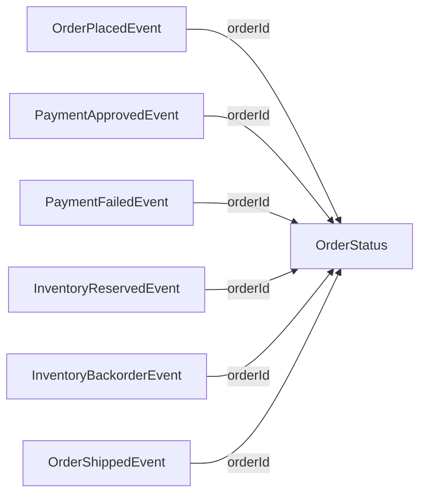

# Schema

ShopTheKafka has no database (see [ADR 0002](./docs/adr/0002-in-memory-materialized-view.md)) — its durable data is the JSON payload of each Event published to Kafka, and its one queryable "table" is OrderStatusService's in-memory materialized view. This document treats those 7 shapes with the same rigor a relational schema would get: every field's name, type, nullability, and purpose.

All Event payloads are JSON, serialized with `camelCase` field names. Every Event shares a common envelope: `eventId` (uniquely identifies this specific event, for tracing/dedup), `orderId` (the Order this event belongs to, and the Kafka partition key — every Event for one Order lands in the same partition, keeping them ordered), and `occurredAtUtc` (when the event happened).

## OrderPlacedEvent

Published by OrderService to `orders-placed` when a customer places an Order.

| Column | Type | Nullable | Default | Purpose |
|---|---|---|---|---|
| eventId | Guid | no | generated | Uniquely identifies this event |
| orderId | Guid | no | generated | The Order being placed; Kafka partition key |
| occurredAtUtc | DateTimeOffset | no | — | When the Order was placed |
| customerId | Guid | no | — | Identifies the customer (no real customer record exists in this demo) |
| items | Item[] | no | — | What was ordered — see Item shape below |
| totalAmount | decimal | no | — | `sum(unitPrice × quantity)` across items, computed once at creation |

**Item** (embedded, not a topic of its own): `itemName` (string, no — the Item's name), `quantity` (int, no — how many units), `unitPrice` (decimal, no — price per unit).

**Key:** `orderId` (correlates with every other schema in this document)

---

## PaymentApprovedEvent

Published by PaymentService to `payment-approved` when the simulated charge succeeds.

| Column | Type | Nullable | Default | Purpose |
|---|---|---|---|---|
| eventId | Guid | no | generated | Uniquely identifies this event |
| orderId | Guid | no | — | The Order that was charged |
| occurredAtUtc | DateTimeOffset | no | — | When the charge was approved |
| paymentId | Guid | no | generated | Identifies this simulated Payment |
| amountCharged | decimal | no | — | Echoes the Order's `totalAmount` |
| items | Item[] | no | — | Echoes the Order's `items`, so InventoryService (which consumes only this topic, not `orders-placed`) knows what to check against the catalog |

**Key:** `orderId`

---

## PaymentFailedEvent

Published by PaymentService to `payment-failed` when the simulated charge fails (~10% of attempts).

| Column | Type | Nullable | Default | Purpose |
|---|---|---|---|---|
| eventId | Guid | no | generated | Uniquely identifies this event |
| orderId | Guid | no | — | The Order whose charge failed |
| occurredAtUtc | DateTimeOffset | no | — | When the charge failed |
| reason | string | no | — | A fixed simulated failure message (e.g. `"Card declined"`) |

**Key:** `orderId`

---

## InventoryReservedEvent

Published by InventoryService to `inventory-reserved` when every Item in the Order is available.

| Column | Type | Nullable | Default | Purpose |
|---|---|---|---|---|
| eventId | Guid | no | generated | Uniquely identifies this event |
| orderId | Guid | no | — | The Order whose Items were reserved |
| occurredAtUtc | DateTimeOffset | no | — | When the reservation happened |

Envelope-only — which Items were reserved is already known from `OrderPlacedEvent.items`.

**Key:** `orderId`

---

## InventoryBackorderEvent

Published by InventoryService to `inventory-backorder` when at least one Item is unavailable. Backorder is all-or-nothing: any unavailable Item backorders the whole Order.

| Column | Type | Nullable | Default | Purpose |
|---|---|---|---|---|
| eventId | Guid | no | generated | Uniquely identifies this event |
| orderId | Guid | no | — | The Order that was backordered |
| occurredAtUtc | DateTimeOffset | no | — | When the backorder was detected |
| unavailableItemNames | string[] | no | — | Which Item names caused the backorder |

**Key:** `orderId`

---

## OrderShippedEvent

Published by ShippingService to `order-shipped` once a Shipment is created for a reserved Order.

| Column | Type | Nullable | Default | Purpose |
|---|---|---|---|---|
| eventId | Guid | no | generated | Uniquely identifies this event |
| orderId | Guid | no | — | The Order that was shipped |
| occurredAtUtc | DateTimeOffset | no | — | When the Shipment was created |
| shipmentId | Guid | no | generated | Identifies the Shipment |
| estimatedDeliveryDate | DateOnly | no | — | Simulated as "today + N days" |

**Key:** `orderId`

---

## OrderStatus

An in-memory record maintained by OrderStatusService, rebuilt from consuming all 6 topics. Not published to Kafka — this is the read model behind `GET /orders/{id}` and the SignalR hub the Blazor UI subscribes to.

| Column | Type | Nullable | Default | Purpose |
|---|---|---|---|---|
| orderId | Guid | no | — | The Order this status describes |
| currentStatus | OrderStatusValue (enum, camelCase string) | no | — | Where the Order currently is: `placed`, `paymentApproved`, `paymentFailed`, `inventoryReserved`, `inventoryBackorder`, `shipped` |
| items | Item[] | no | — | Snapshotted once from `OrderPlacedEvent` so the UI doesn't need a second lookup |
| totalAmount | decimal | no | — | Snapshotted once from `OrderPlacedEvent` |
| timeline | TimelineEntry[] | no | `[]` | One entry per Event consumed for this Order, in order |

**TimelineEntry** (embedded): `status` (OrderStatusValue, no — which stage this entry represents), `occurredAtUtc` (DateTimeOffset, no — when it happened), `detail` (string, yes — populated only for `paymentFailed` entries with the failure reason, or `inventoryBackorder` entries with the unavailable item names; `null` otherwise).

**Key:** `orderId`

---

## Relationships

There is no database and therefore no foreign keys or cascade-delete rules. Instead, every schema above is **correlated by `orderId`**: it is the Kafka partition key on all 6 topics, and the primary key of the `OrderStatus` record. Given an `orderId`, every Event that has occurred for that Order is guaranteed to have been published to the same partition of its topic, in order — which is what lets OrderStatusService rebuild a consistent timeline purely by consuming the log.

